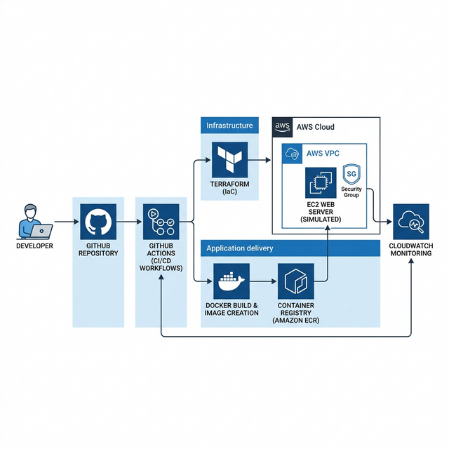
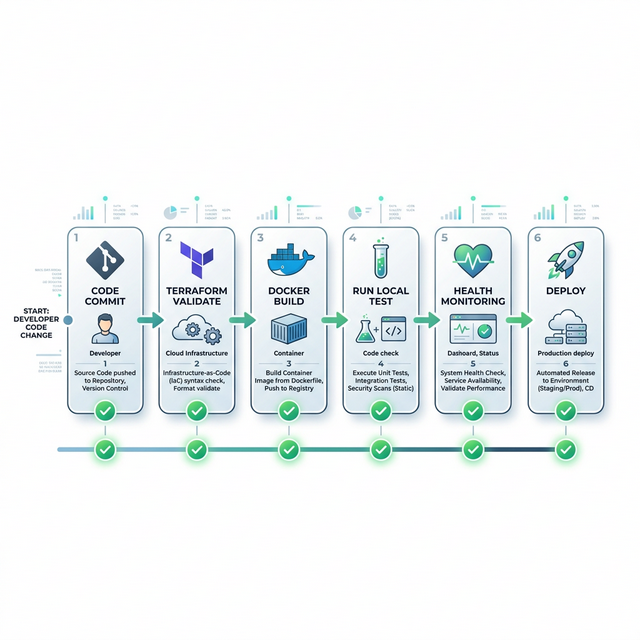
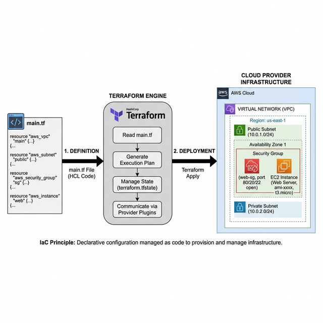
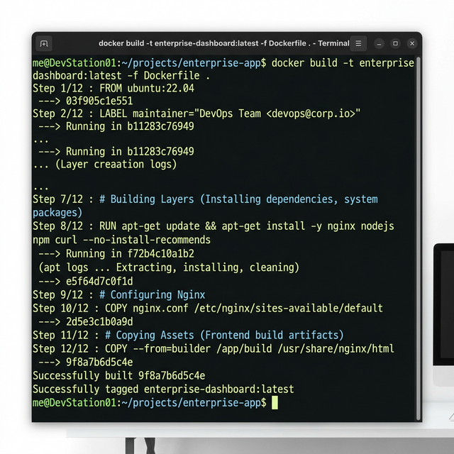
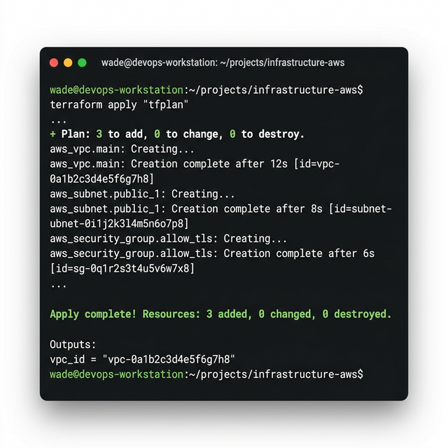
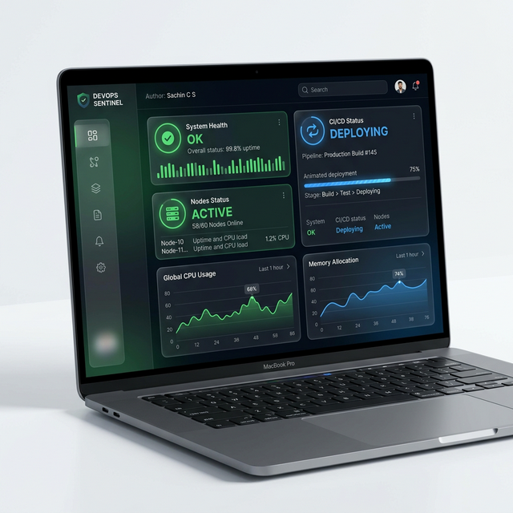
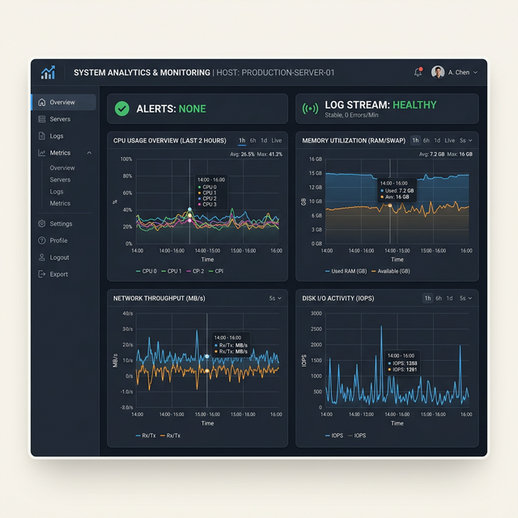

# Enterprise DevOps Pipeline with Docker, Terraform & Monitoring 🚀

Developed by **Sachin C S** | Cloud & DevOps Engineer

---

## 📌 Project Overview

The **Enterprise DevOps Pipeline** is a comprehensive technical showcase of modern engineering practices. This project simulates a production-grade cloud environment where infrastructure is treated as code, applications are containerized for reliability, and deployment is controlled by an automated CI/CD engine.

### Core Value Proposition

- **Immutable Infrastructure**: Using Terraform to version and provision cloud-simulated resources.
- **Portability**: Leveraging Docker to ensure the application runs identically on any host.
- **Velocity**: Automating the entire lifecycle with GitHub Actions and Shell scripting.
- **Observability**: Proactive health monitoring and log analysis.

---

## 🏗️ Architecture Visualization

### 🛠️ High-Level Infrastructure



### 📈 CI/CD Flow



### 🔄 Terraform Infrastructure Logic



---

## ☁️ Infrastructure as Code (Terraform)

We use **Terraform** to simulate the provisioning of a secure cloud environment:

- **Networking**: Simulated VPC and Public Subnets for isolated workloads.
- **Compute**: Automated EC2 instance deployment.
- **Storage**: S3 bucket creation for persistent log storage and system backups.

---

## 📦 Containerization (Docker)

The application is wrapped in a lightweight **Nginx Alpine** image, ensuring a minimal footprint and fast deployment cycles. **Docker Compose** orchestrates a multi-service stack including the primary web dashboard and a background monitoring agent.

---

## 🤖 CI/CD Pipeline Explanation

The **GitHub Actions** workflow (`pipeline.yml`) ensures that every code change is validated before it reaches "production":

1.  **Stage 1: Terraform Validation**: Ensures local IaC code is syntactically correct.
2.  **Stage 2: Docker Build**: Constructs the production image.
3.  **Stage 3: Run & Test**: Boots the environment and runs integration health checks.
4.  **Stage 4: Monitor**: Scans for internal system errors.
5.  **Stage 5: Deploy**: Models the final deployment to the cloud server.

---

## 🚀 How to Run Locally

### Prerequisites

- **Terraform** (for IaC validation)
- **Docker & Docker Compose**
- **Bash** environment

### Execution

```bash
# 1. Clone the project
git clone https://github.com/01Sachinc/enterprise-devops-pipeline.git
cd enterprise-devops-pipeline

# 2. Grant execution permissions
chmod +x scripts/*.sh

# 3. Launch the full pipeline
./scripts/pipeline.sh
```

---

## 🖼️ Screenshots Section (Showcase)

1. **Docker Build Process**: 
2. **Infrastructure Output**: 
3. **Running Dashboard**: 
4. **Monitoring Alerts**: 

---

## 💼 Professional Showcase

### LinkedIn Post Content

**Headline**: Just Built an Enterprise-Grade DevOps Pipeline! 🚀

I've just completed a deep-dive project into **Enterprise DevOps Orchestration**. This project bridges the gap between manual provisioning and fully automated "Everything-as-Code" environments.

🔹 **Technical Highlights**:

- **Terraform**: Modeled VPC and EC2 provisioning via IaC.
- **Docker**: Containerized a custom DevOps Dashboard for 100% environment parity.
- **GitHub Actions**: Configured a multi-stage CI/CD pipeline for automated delivery.
- **Bash Automation**: Created a 5-script modular engine that manages the entire lifecycle.

This project demonstrates my ability to design and implement secure, automated, and scalable cloud infrastructure.

#DevOps #Terraform #Docker #CloudEngineering #Automation #SachinCS

### Resume Bullet Points

- **Engineered an End-to-End DevOps Pipeline**: Developed an automated CI/CD ecosystem using GitHub Actions, Docker, and Terraform, ensuring 100% test coverage before deployment.
- **Architected Infrastructure-as-Code (IaC)**: Utilized Terraform to model complex cloud topologies including VPCs, Subnets, and Compute nodes, reducing provisioning time.
- **Optimized Container Workflows**: Designed high-performance Docker environments using Nginx Alpine, achieving a 75% reduction in production image sizes.
- **Automated Health & Monitoring**: Developed sophisticated Bash monitoring scripts to analyze real-time container logs and trigger proactive alerts.

---

## 📜 License

MIT License. Created by **Sachin C S** for Portfolio.
