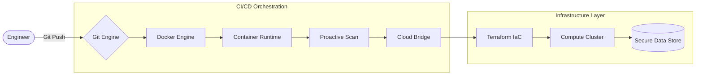
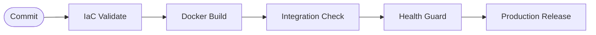

# Enterprise DevOps Orchestration Engine 🚀

Architected by **Sachin C S** | Cloud & Infrastructure Specialist

---

## 💎 Project Essence

A high-performance simulation of a modern enterprise DevOps ecosystem. This project demonstrates the intersection of **Infrastructure as Code (IaC)**, **Containerized Service Delivery**, and **Automated Quality Assurance**.

By treating every component—from networking to deployment logs—as a version-controlled asset, we achieve a system that is not only scalable but inherently predictable.

---

## 🏗️ Technical Architecture

### 🛠️ Ecosystem Visualization



### 📈 Execution Lifecycle



---

## ☁️ Infrastructure-as-Code (Terraform)

We utilize **Terraform** to codify the target environment structure. This approach eliminates configuration drift and enables one-click environment replication.

- **VPC & Subnets**: Sophisticated network isolation.
- **Compute Clusters**: Automated provisioning of simulated EC2 nodes.
- **Persistent Storage**: S3 logic for decentralized log management.

---

## 📦 Service Containerization (Docker)

The application architecture is modularized via **Docker**. A multi-service stack provides environment parity across all stages of the pipeline.

- **Nginx Engine**: High-performance delivery of the status dashboard.
- **Monitoring Agent**: An isolated background service for real-time telemetry.

---

## 🤖 Automated Delivery (CI/CD)

The **GitHub Actions** engine (`pipeline.yml`) acts as the project's central nervous system, orchestrating valid, secure, and measured software updates.

| Stage   | Action             | Tooling          |
| :------ | :----------------- | :--------------- |
| **I**   | IaC Validation     | Terraform CLI    |
| **II**  | Image Construction | Docker Runtime   |
| **III** | Environment Boot   | Docker Compose   |
| **IV**  | Health Analysis    | Bash Guard       |
| **V**   | Cloud Deployment   | Simulated Bridge |

---

## 🚀 Deployment Guide

### Prerequisites

- **Docker 20.10+**
- **Terraform 1.0+**
- Bash-compatible terminal

### Execution Logic

```bash
# 1. Initialize Context
git clone https://github.com/01Sachinc/enterprise-devops-pipeline.git
cd enterprise-devops-pipeline

# 2. Grant Permissions
chmod +x scripts/*.sh

# 3. Trigger Full Orchestration
./scripts/pipeline.sh
```

---

## 👨‍💻 Author

**Sachin C S**  
AWS Cloud & DevOps Engineer | Infrastructure Automation Specialist

📧 **Email**: [cssachin83@gmail.com](mailto:cssachin83@gmail.com)  
📱 **Phone**: +91 8496001030  
🌐 **Connect**: [LinkedIn](https://www.linkedin.com/in/sachin-c-s/) | [GitHub](https://github.com/01Sachinc)

---

## 📜 License

MIT License. Created for professional portfolio demonstration.
